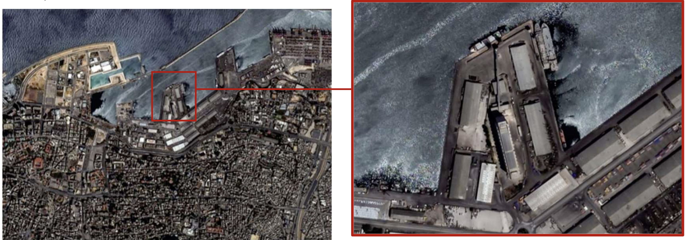
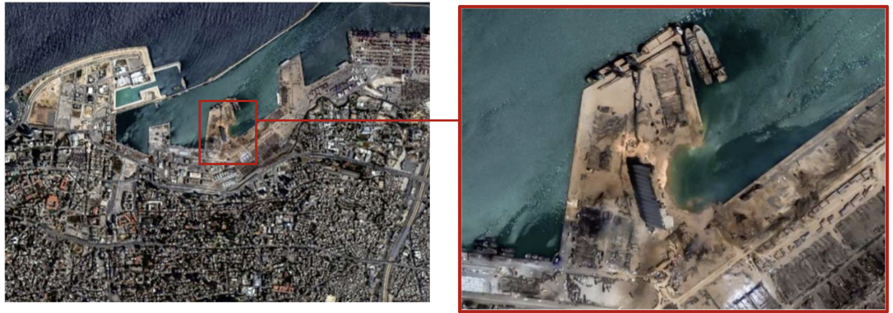

```{=html}
<div class="part-badge">Lab Part 1 of 2</div>
```

::: objectives
**Learning objectives**

-   Understand what MAXAR very-high-resolution satellite imagery is and how it was used to document the Beirut blast
-   Load, visualise and interpret raster and vector satellite data
-   Classify and map damage intensity across the blast zone, anchored to the blast epicentre
-   Quantify and visualise how destruction decays with distance from the port
:::

------------------------------------------------------------------------

## 1.1 Background: the data and its origins

### The Beirut Port Explosion

On **4 August 2020**, approximately 2,750 tonnes of ammonium nitrate that had been stored unsafely at Beirut's port exploded, killing more than 200 people, injuring thousands, and destroying or damaging an estimated 77,000 buildings across the city. The blast was felt as far away as Cyprus.

### Who collected this imagery?

The satellite images used in this lab were collected by **Maxar Technologies** — at the time one of the world's leading commercial Earth observation companies, operating the WorldView constellation of very-high-resolution (VHR) optical satellites (WorldView-2, WorldView-3, GeoEye-1) capable of sub-metre resolution (\~30–50 cm panchromatic).

::: callout-note
## A note on Maxar's current status

Maxar Technologies no longer exists as a single company. In May 2023 it was acquired by private equity firm Advent International for \$6.4 billion and subsequently split into two independent entities: **Vantor** (formerly Maxar Intelligence — the Earth imagery and analytics side, which still operates the WorldView satellites) and **Lanteris Space Systems** (formerly Maxar Space Systems — satellite manufacturing). The rebrand was announced in October 2025. The open data programme and the Beirut dataset remain accessible and the imagery copyright attribution still reads *Maxar Technologies Inc.*, as that was the company name at the time of collection.
:::

### The open data release

Following the explosion, Maxar released pre- and post-event imagery under their **Open Data Program**, making it freely available for humanitarian response. The data we use in this lab comes from that release:

> [maxar.com/open-data/beirut-explosion](https://www.maxar.com/open-data/beirut-explosion)

> <https://vantor.com/company/open-data-program/>

We work with three image tiles:

| File                   | Description                                 |
|------------------------|---------------------------------------------|
| `10300100AB8F4A00.tif` | Pre-event WorldView image (July 2020)       |
| `10300500A5F95600.tif` | Post-event WorldView image (August 5, 2020) |
| `MX_31Jul_5Aug_UN.tif` | UN-processed composite (31 Jul – 5 Aug)     |

The vector building footprints are from **Ecopia Tech Corporation**, who digitised structures from the satellite imagery. Although building footprints were also released by [Beirut Urban Lab](https://beiruturbanlab.com/) afte the blast.

::: callout-warning
## Data licence

This data is licensed under **Creative Commons Attribution-NonCommercial 4.0 International** (CC BY-NC 4.0).

-   ✅ You may use and adapt it for non-commercial purposes
-   ✅ You must credit: *Vector Data © 2020 Ecopia Tech Corporation; Image Data © 2020 Maxar Technologies Inc.*
-   ❌ You may not use it for commercial purposes

Full licence: [creativecommons.org/licenses/by-nc/4.0](https://creativecommons.org/licenses/by-nc/4.0/)
:::

------------------------------------------------------------------------

## 1.2 How does satellite damage assessment work?

Before touching the data, it helps to understand the **chain of scale**: how do we get from a satellite hundreds of kilometres above Beirut to a number — "12 % of this neighbourhood was severely damaged" — that a humanitarian agency can act on?

The answer is a four-step pipeline. The hardest thing to keep in your head as you read it is just *how small a pixel is*.

### Step 0 — What is a pixel, really?

WorldView-2 and WorldView-3 produce panchromatic imagery at roughly **0.3–0.5 metres per pixel**. To make that concrete:

| If a pixel is...        | Then the area it covers is...    | And a typical Beirut apartment building (say 20 × 30 m) is... |
|-------------------------|----------------------------------|---------------------------------------------------------------|
| 0.5 m × 0.5 m           | 0.25 m² — about a dinner plate   | ~2,400 pixels                                                 |
| 1 m × 1 m               | 1 m² — a doormat                 | ~600 pixels                                                   |
| 10 m × 10 m (Sentinel-2)| 100 m² — a small studio flat     | ~6 pixels — building barely resolved                          |
| 30 m × 30 m (Landsat)   | 900 m² — half a football pitch   | <1 pixel — building invisible                                 |

This is why MAXAR / WorldView-class imagery is special: at 0.5 m, a single building generates **thousands of pixels**, so a collapsed roof, a cleared lot, or a debris pile each leave a clear statistical signature. With Landsat, the whole building would be a smudge.

For the Beirut tiles we'll work with, the raster covers roughly **80 km²** of greater Beirut. At ~0.5 m resolution that is on the order of **300 million pixels per band**, across 3 spectral bands (RGB), for both the pre- and post-event acquisition — i.e. **~1.8 billion numbers in total**. This is why we don't run the heavy steps live in the lab.

### What we actually feed into the pipeline

There are two versions of the MAXAR data floating around, and it matters which one we use:

::: {.callout-important}
## Raw MAXAR tiles vs. the UN-calibrated composite
**Raw open-data tiles** (`10300100AB8F4A00.tif`, `10300500A5F95600.tif`, `104001005BD06800.tif`) are released by MAXAR essentially as the satellite saw them — useful, but each tile has its own sun angle, atmospheric haze, and viewing geometry, so a pre/post comparison done on the raw tiles will pick up a lot of *nuisance* change that has nothing to do with the explosion.

**The UN-processed composite** (`MX_31Jul_5Aug_UN.tif`) is the version we actually use in this lab. It has been pre-processed by the **Humanitarian OpenStreetMap Team (HOT)** and **UN-SPIDER** with the full VHR correction chain:

- **Orthorectification** — terrain and viewing-geometry distortions removed, so a pixel at (x, y) on the pre-image corresponds to the same patch of ground as (x, y) on the post-image.
- **Atmospheric compensation** — haze, aerosols and water-vapour effects normalised across acquisitions.
- **Dynamic range adjustment** — brightness and contrast harmonised so the two dates are radiometrically comparable.
- **Pansharpening** — the high-resolution panchromatic band is fused with the lower-resolution multispectral bands, giving us colour imagery at the panchromatic ~0.5 m resolution.
:::

Both acquisitions are delivered as **three spectral bands**, matching the visible spectrum the human eye sees:

| Band  | Wavelength       | What it picks up                                          |
|-------|------------------|-----------------------------------------------------------|
| <span style="color:#FF0000; font-weight:bold;">RED</span>   | 630–690 nm | Exposed brick, tile, rusted metal, bare soil, dust  |
| <span style="color:#00FF00; font-weight:bold;">GREEN</span> | 510–580 nm | Vegetation, painted surfaces, water                       |
| <span style="color:#0000FF; font-weight:bold;">BLUE</span>  | 450–510 nm | Shadow, water, smoke, atmospheric scattering              |

So our input is a pair of 3-band rasters — one from 31 July 2020, one from 5 August 2020 — at ~0.5 m per pixel, already aligned and radiometrically harmonised.

### The key assumption

Because the two acquisitions are only **five days apart**, we make a strong but useful simplifying assumption:

> *Over a five-day window in early August, the only thing in central Beirut that changed materially is the explosion. Anything else — traffic, parked cars, market stalls, drying laundry — is statistical noise that washes out at the zonal aggregation stage.*

Under this assumption, **the difference between the before and after images = the damage**. This is what makes the pipeline tractable: we don't have to model what Beirut "normally" looks like, only what it looked like on these two specific dates.

### Step 1 — Image differencing

With Step 0 in mind — three bands, ~0.5 m pixels, two dates five days apart, already co-registered — the first computational step is straightforward: for every one of those ~300 million pixels, ask *did this patch of ground change?*

The operation is band-by-band division of the post-event image by the pre-event one, on a log scale:

```         
log10( Band_after / Band_before )  →  positive = brighter after (rubble, dust, exposed concrete)
                                       negative = darker after (collapsed structure, shadow)
                                       near zero = no change
```

We use the **log-ratio** rather than simple subtraction `after − before` because the two images were taken on different days, with different sun angles and atmospheric conditions. The log-ratio is more robust to those nuisance differences: multiplicative illumination effects become additive and largely cancel out. The output is a 3-band raster with the same \~0.5 m pixel size as the inputs.

::: callout-note
## More advanced approaches

Log-ratio differencing is a transparent, reproducible baseline — but the field has moved well beyond it. Two recent papers I admire:

-   Scher, C., & Van Den Hoek, J. (2025). [Nationwide conflict damage mapping with interferometric synthetic aperture radar: a study of the 2022 Russia–Ukraine conflict](https://www.sciencedirect.com/science/article/pii/S2666017225000239). *Science of Remote Sensing.*
-   Scher, C., & Van Den Hoek, J. (2025). [Active InSAR monitoring of building damage in Gaza during the Israel-Hamas War](https://arxiv.org/abs/2506.14730). *arXiv preprint.*

Both use radar (SAR) rather than optical imagery, which can see through clouds and at night — at the cost of harder-to-interpret pixel values.
:::

### Step 2 — Classification (pixel → damage class)

After differencing we have a continuous log-ratio value for every pixel, but humans don't act on continuous values — humanitarian responders act on categories like *severe / moderate / little-to-no damage*. So the next step **classifies** each pixel into a small number of damage classes.

::: {.callout-note}
## We don't run this step in the lab
Training and tuning the classifier is the most compute-heavy part of the pipeline, and our focus today is on **comparing the satellite-derived damage to the survey** (Part 2). We describe the step here so you understand where the damage classes come from, then pick up the pipeline from its pre-computed output.
:::

The original analysis uses a **supervised Random Forest classifier**, following the methodology Dell'Acqua et al. developed for damage assessment after the 2009 L'Aquila earthquake. The idea is to teach the algorithm what damage looks like from hand-labelled examples, then score every remaining pixel.

The classifier sees a **6-band stack** — the pre-event RGB bands and the post-event RGB bands appended together — clipped to the Beirut extent. Training labels come from polygons hand-digitised over areas the analyst is confident about (a clearly collapsed warehouse for *severe damage*, an untouched residential block for *no damage*), with pixels sampled at random from inside those polygons. The forest is tuned by watching the **out-of-bag error** fall as trees are added, stopping when it converges.

The output is a single-band raster at the original ~0.5 m resolution where every cell carries a discrete label:

| Value | Class               |
|-------|---------------------|
| `1`   | Severe damage       |
| `2`   | Medium damage       |
| `3`   | Little to no damage |

This is what gets passed to Step 3, where we count *severe* pixels inside each operational zone and divide by zone area.

### Step 3 — Aggregation to zones (pixel → neighbourhood)

A pixel-level damage map is too granular for policy or humanitarian targeting — agencies operate at the neighbourhood (cadastre / operational zone in the case of Beirut) scale, not the dinner-plate scale. So the final step **aggregates** pixel classifications up using **zonal statistics**:

> For each operational zone polygon, count how many pixels fall inside it, count how many of those are classified as severe damage, and divide.

So a zone of 0.2 km² contains roughly **800,000 pixels** at 0.5 m resolution. If 96,000 of those are classified as severely damaged, the zone is reported as **12 % severely damaged**. That percentage is the variable `pct_severe_adj` we'll be mapping for the rest of the lab.

### The pipeline in one picture

```         
WorldView tile        WorldView tile
    (pre-event RGB)      (post-event RGB)
    ~0.5 m pixels         ~0.5 m pixels
         │                     │
         └──────────┬──────────┘
                    │  stack pre + post → 6-band input
                    │  clip to Beirut extent
                    ▼
         6-band stacked raster
         (Pre_R, Pre_G, Pre_B, Post_R, Post_G, Post_B)
                    │
                    │  log10(after / before), band by band     ◀── Step 1: pixel-level change
                    ▼
         6-band stacked raster
         (Pre_R, Pre_G, Pre_B, Post_R, Post_G, Post_B)
                    │
                    │  supervised Random Forest                ◀── Step 2: pixel → class
                    │  trained on hand-labelled polygons,
                    │  tuned by OOB error
                    ▼
         Single-band damage class raster
         (1 = severe, 2 = medium, 3 = little/none)
                    │
                    │  zonal statistics:                       ◀── Step 3: pixel → zone
                    │  count severe pixels per polygon
                    ▼
         Damage % per operational zone
         (the vector layer we load in §1.6)
```

::: callout-tip
## Key limitations to keep in mind throughout

-   **Line-of-sight bias**: at nadir the satellite sees rooftops, not facades. A building with intact roof but blown-out walls can look fine from above.
-   **Rubble removal**: pixels cleared before the post-image was acquired show no change signature and read as undamaged.
-   **Cloud and smoke**: optical sensors can't see through either.
-   **Temporal gap**: the "post" image was acquired \~24 hours after the blast — early enough that little reconstruction has happened, but late enough that some pixels have shifted (vehicles moved, fires extinguished).
-   **The 0.5 m floor**: anything genuinely smaller than the pixel (a cracked window, a damaged car wheel) is invisible to this method.
:::

------------------------------------------------------------------------

## 1.3 Setup

```{r}
#| label: setup
#| message: false
#| warning: false

library(here)       # project-relative file paths

library(terra)      # modern raster operations (replaces the retired raster package)
library(sf)         # vector spatial data
library(classInt)   # break classification for choropleths

library(tidyverse)  # data wrangling + ggplot2 (loads ggplot2, dplyr, tidyr, etc.)

library(tmap)       # thematic mapping
library(ggspatial)  # scale bar, north arrow, basemap tiles
library(ggrepel)    # non-overlapping text labels on maps
library(viridis)    # accessible colour palettes
```

------------------------------------------------------------------------

## 1.4 The full pipeline (illustrated, not run)

The three steps from §1.2 — differencing, classification, zonal aggregation — are a recipe that goes from two raw MAXAR tiles to a single percentage per neighbourhood. Schematically:

```
2 × 3-band rasters   →   6-band stacked input   →   1 × 1-band class raster   →   1 polygon per zone
(pre, post RGB)        (Random Forest input)       (severe / medium / none)      (% severe)
```

The pipeline is heavy: the raw tiles are several GB each, and training the Random Forest takes time to tune. **We don't run any of it in this lab** — our focus is on comparing the satellite output to the survey data (Part 2), not on reproducing the damage map from scratch. The pre-computed output is what we load in §1.5 and §1.6.

::: callout-tip
## Want to see the pipeline demonstrated?

A separate companion document walks through all three steps — loading the raw tiles, stacking pre + post, training and applying the supervised Random Forest and aggregating to zones — as a runnable R recipe. You won't need it for this lab, but it's there if you want to adapt the workflow to a different event.

🔗 **[lab_append.qmd](lab_append.qmd)** — the full pipeline, illustrated (not run)
:::

::: callout-tip
## Sense-check the orders of magnitude

A zone of 0.2 km² at 0.5 m resolution contains roughly **800,000 pixels**. If `n_severe_px` for that zone comes back as \~96,000, then `pct_severe ≈ 12 %`. If it comes back as 0 or as 800,000, something has gone wrong — either a class id is mismatched, or the mask did not align with the zone boundary. Always sanity-check denominators on a known zone first.
:::

------------------------------------------------------------------------

## 1.5 Load and explore the composite

From here on, everything is live. We work directly with `MX_31Jul_5Aug_UN.tif` — the UN-processed composite that stacks the pre- and post-event RGB scenes into a single 6-band file (bands 1–3 = pre, bands 4–6 = post). This is a manageable derivative of Step 1 above; we use it for visualisation, while the *damage* numbers we map come from a vector file produced by Step 3.

```{r}
#| label: load-raster

# 6-band GeoTIFF: bands 1–3 = pre-event RGB, bands 4–6 = post-event RGB
# CRS is geographic (WGS84): resolution ~0.5m expressed in degrees

beirut_img <- terra::rast("data/maxmar_processed/MX_31Jul_5Aug_UN.tif")
beirut_img
```

```{r}
#| label: inspect-raster

nlyr(beirut_img)                   # number of bands (expect 6)
res(beirut_img)                    # pixel resolution in degrees (~0.5m at this latitude)
crs(beirut_img, describe = TRUE)   # coordinate reference system
ext(beirut_img)                    # spatial extent (lon/lat bounding box)
names(beirut_img)                  # band names if set
```

::: callout-tip
## Read the raster header like a story

The output above tells you four things — write them down before plotting anything:

-   **Layers**: 6 — the 3 pre-event RGB bands stacked on top of the 3 post-event RGB bands.
-   **Resolution**: at this latitude, \~0.5 m on the ground per pixel. Because the CRS is geographic (WGS84), `res()` reports it in *decimal degrees* (\~4.5e-6°), which is a confusing unit until you realise 1° ≈ 111 km at the equator. Reproject to a metric CRS if you ever need to read pixel size directly.
-   **CRS**: geographic (EPSG:4326). For zonal statistics later we'll be in EPSG:22770 (Deir el Zor) — a mismatch in CRS between raster and vector is the single most common source of bugs in this kind of analysis.
-   **Extent**: the lon/lat bounding box. Multiply (width × height) in metres to get the footprint — for the cropped Beirut tile this is on the order of 80 km², i.e. \~300 million pixels per band.

So when you `plot(beirut_img[[1]])` below, every visible dot in that image is a 0.5 m × 0.5 m patch of Beirut — small enough to resolve a parked car, a market stall, a damaged roof corner.
:::

### Visualise all six bands individually

```{r}
#| label: plot-bands
#| fig-width: 9
#| fig-height: 5

par(mfrow = c(2, 3))
for (i in 1:6) {
  plot(beirut_img[[i]], main = paste0("Band ", i, ": ", names(beirut_img)[i]))
}
par(mfrow = c(1, 1))
```

The band-by-band plots may not be immediately intuitive — this is why we use RGB composites.

### Pre- and post-event RGB composites side by side

```{r}
#| label: plot-rgb
#| fig-width: 10
#| fig-height: 5.5

par(mfrow = c(1, 2))

plotRGB(beirut_img, r = 1, g = 2, b = 3,
        stretch = "lin",
        main    = "Pre-event (Jul 31)")

plotRGB(beirut_img, r = 4, g = 5, b = 6,
        stretch = "lin",
        main    = "Post-event (Aug 5)")

par(mfrow = c(1, 1))

```

Even visually, the destruction around the port is apparent if you look next to the silos.

::: {layout-ncol=2}
{width="70%"}

{width="70%"}
:::

------------------------------------------------------------------------

## 1.6 Load the damage zones (vector)

This is the output of **Step 3 of the pipeline in §1.4**: a polygon shapefile where every operational zone carries the count and percentage of pixels classified as severely damaged. Each polygon represents the *aggregation* of hundreds of thousands of 0.5 m pixel decisions into one number a humanitarian agency can act on.

```{r}
#| label: load-vector

damage_zones <- st_read("data/geo/raster_rf_damage2.shp", quiet = TRUE)

# Inspect
glimpse(damage_zones)
names(damage_zones)

damage_zones <- damage_zones |>
  dplyr::rename(
    object_id      = OBJECTI,
    acs_code       = ACS_COD,
    cadastre       = Cdstr_1,
    district       = Dstrc_1,
    governorate    = Govrnrt,
    zone_number    = zon_nmb,
    pct_severe_raw = pct_sv_,
    pct_severe_adj = pct___2
  ) |>
  dplyr::mutate(
    area_m2  = as.numeric(sf::st_area(geometry)),
    area_km2 = area_m2 / 1e6,
  ) |>
  dplyr::select(-Shp_Lng, -Shap_Ar)   # drop the unhelpful degree-based columns

glimpse(damage_zones)
```

### Anchor the map: the blast epicentre

The explosion originated at **Hangar 12** of the Port of Beirut. Pinning this point lets us label distances, draw concentric reference rings, and quantify how damage decays with proximity to the source.

```{r}
#| label: epicentre

# Hangar 12, Port of Beirut (approximate epicentre coordinates)
epicentre <- sf::st_sfc(
  sf::st_point(c(35.5189, 33.9013)),
  crs = 4326
) |>
  sf::st_transform(sf::st_crs(damage_zones))

# Distance from each zone centroid to the epicentre, in km
damage_zones <- damage_zones |>
  dplyr::mutate(
    dist_km = as.numeric(
      sf::st_distance(sf::st_centroid(geometry), epicentre)
    ) / 1000
  )

summary(damage_zones$dist_km)
```

------------------------------------------------------------------------

## 1.7 Visualise the damage

### Static map with epicentre and top zones labelled

To make the map *interpretable*, we add two things:

-   A cross marking the **blast epicentre** at Hangar 12 of the Port of Beirut.
-   **Labels for the 8 most-damaged cadastres**, so the eye doesn't have to jump between map and table to identify them.

```{r}
#| label: map-damage
#| fig-width: 8
#| fig-height: 7
#| warning: false

# Compute quantile breaks
brks <- round(
  classInt::classIntervals(damage_zones$pct_severe_adj, n = 7, style = "quantile")$brks,
  1
)

# Top zones to label directly on the map
top_labels <- damage_zones |>
  dplyr::slice_max(pct_severe_adj, n = 8) |>
  dplyr::mutate(
    label_xy = sf::st_centroid(geometry)
  )

ggplot(damage_zones) +
  annotation_map_tile(
    type = "cartolight",
    zoom = 14,
    progress = "none"
  ) +
  geom_sf(
    aes(fill = pct_severe_adj),
    colour = "white",
    linewidth = 0.3,
    alpha = 0.85
  ) +
  # Epicentre marker
  geom_sf(
    data = epicentre,
    shape = 4, size = 5, stroke = 1.4, colour = "black"
  ) +
  geom_sf_text(
    data = epicentre,
    label = "Epicentre",
    nudge_y = 0.003, size = 3, fontface = "bold"
  ) +
  # Labels for top-damaged zones
  ggrepel::geom_label_repel(
    data = top_labels,
    aes(label = cadastre, geometry = geometry),
    stat = "sf_coordinates",
    size = 2.7,
    alpha = 0.9,
    label.size = 0,
    label.padding = unit(0.12, "lines"),
    min.segment.length = 0,
    segment.colour = "grey30",
    segment.size = 0.3,
    max.overlaps = Inf
  ) +
  scale_fill_fermenter(
    palette = "YlOrRd",
    direction = 1,
    breaks = brks,
    name = "% pixels\nseverely damaged"
  ) +
  annotation_scale(
    location = "bl",
    width_hint = 0.25,
    text_cex = 0.7
  ) +
  annotation_north_arrow(
    location = "br",
    which_north = "true",
    height = unit(0.8, "cm"),
    width = unit(0.8, "cm"),
    style = north_arrow_fancy_orienteering
  ) +
  labs(
    title = "Severe Damage Density by Operational Zone",
    subtitle = "Beirut Port Explosion, August 2020 · top 8 cadastres labelled"
  ) +
  theme_void() +
  theme(
    plot.title = element_text(size = 11, hjust = 0.5, face = "bold"),
    plot.subtitle = element_text(size = 9, hjust = 0.5),
    legend.position = "right",
    legend.title = element_text(size = 9),
    legend.text = element_text(size = 8)
  )

```

------------------------------------------------------------------------

## 1.8 Damage distribution

```{r}
#| label: damage-distribution
#| fig-width: 7
#| fig-height: 4

damage_zones |>
  st_drop_geometry() |>
  ggplot(aes(x = pct_severe_adj)) +
  geom_histogram(bins = 25, fill = "#1a2744", colour = "white", linewidth = 0.2) +
  geom_vline(
    xintercept = median(damage_zones$pct_severe_adj, na.rm = TRUE),
    colour = "#e8a020", linetype = "dashed", linewidth = 1
  ) +
  annotate("text",
    x = median(damage_zones$pct_severe_adj, na.rm = TRUE),
    y = Inf, vjust = 1.5, hjust = -0.1,
    label = paste0(
      "Median: ",
      round(median(damage_zones$pct_severe_adj, na.rm = TRUE), 1),
      "%"
    ),
    colour = "#e8a020", size = 3.5
  ) +
  labs(
    title    = "Distribution of severe damage density across zones",
    subtitle = "Beirut operational zones · RF classification",
    x        = "% of zone classified as severely damaged",
    y        = "Number of zones"
  ) +
  theme_minimal(base_size = 12)
```

------------------------------------------------------------------------

## 1.9 How does damage decay with distance from the port?

The histogram tells us *how much* damage there is overall, but not *where*. Plotting severe-damage percentage against distance from the epicentre gives us the spatial structure in a single chart — and a sanity check on the map.

```{r}
#| label: distance-decay
#| fig-width: 7.5
#| fig-height: 4.5

damage_zones |>
  st_drop_geometry() |>
  ggplot(aes(x = dist_km, y = pct_severe_adj)) +
  geom_point(
    aes(size = area_km2),
    alpha = 0.55,
    colour = "#b30000"
  ) +
  geom_smooth(
    method = "loess",
    se = TRUE,
    colour = "#1a2744",
    fill = "#1a2744",
    alpha = 0.15,
    linewidth = 0.8
  ) +
  scale_size_continuous(range = c(1, 6), name = "Neighbourhood area (km²)") +
  labs(
    title    = "Severe damage decays with distance from the blast epicentre",
    subtitle = "Each point is one neighbourhood · LOESS smoother in navy",
    x        = "Distance from blast epicentre (km)",
    y        = "% of zone severely damaged"
  ) +
  theme_minimal(base_size = 12) +
  theme(
    plot.title = element_text(face = "bold")
  )
```

::: callout-note
## Reading the decay curve

The drop-off is typically steep within the first 1–2 km of the port and then flattens. Points sitting *above* the smoother are zones that suffered more damage than their distance alone would predict — worth investigating. Points *below* it are spared.
:::

------------------------------------------------------------------------

## 1.10 Most damaged zones — ranked

Rather than a plain table, we rank the top 10 cadastres/neighbourhoods by its distance from the blast epicentre. This pulls together *magnitude* and *geography*.

For reference, the same ten zones as a compact table:

```{r}
#| label: top-zones-table

damage_zones |>
  st_drop_geometry() |>
  arrange(desc(pct_severe_adj)) |>
  slice_head(n = 10) |>
  dplyr::select(zone_number, cadastre, area_km2, dist_km, pct_severe_adj) |>
  mutate(
    area_km2       = round(area_km2, 3),
    dist_km        = round(dist_km, 2),
    pct_severe_adj = round(pct_severe_adj, 2)
  ) |>
  knitr::kable(
    col.names = c("Zone", "Cadastre", "Area (km²)", "Distance to port (km)", "% Severe"),
    caption   = "Ten most severely damaged operational zones"
  )
```

------------------------------------------------------------------------

## Let's have a think

::: callout-tip
## Your turn

Distance from the blast clearly matters — but it's only one variable. Take a minute to brainstorm: **what else might explain why two zones at the same distance from the port show very different damage levels?**

A few prompts to get you started:

- What is *between* the zone and the blast? (Other buildings, the silos, terrain.)
- What is the zone *made of*? (Building age, construction materials, window glazing.)
- Which *direction* does the zone sit relative to the port?
- Are there factors that would make damage easier or harder to *detect from above*?

:::

------------------------------------------------------------------------

::: callout-note
## Up next

In **Part 2** we load the survey data and ask: does what the satellite sees match what households reported on the ground — and where do the two sources diverge?
:::
