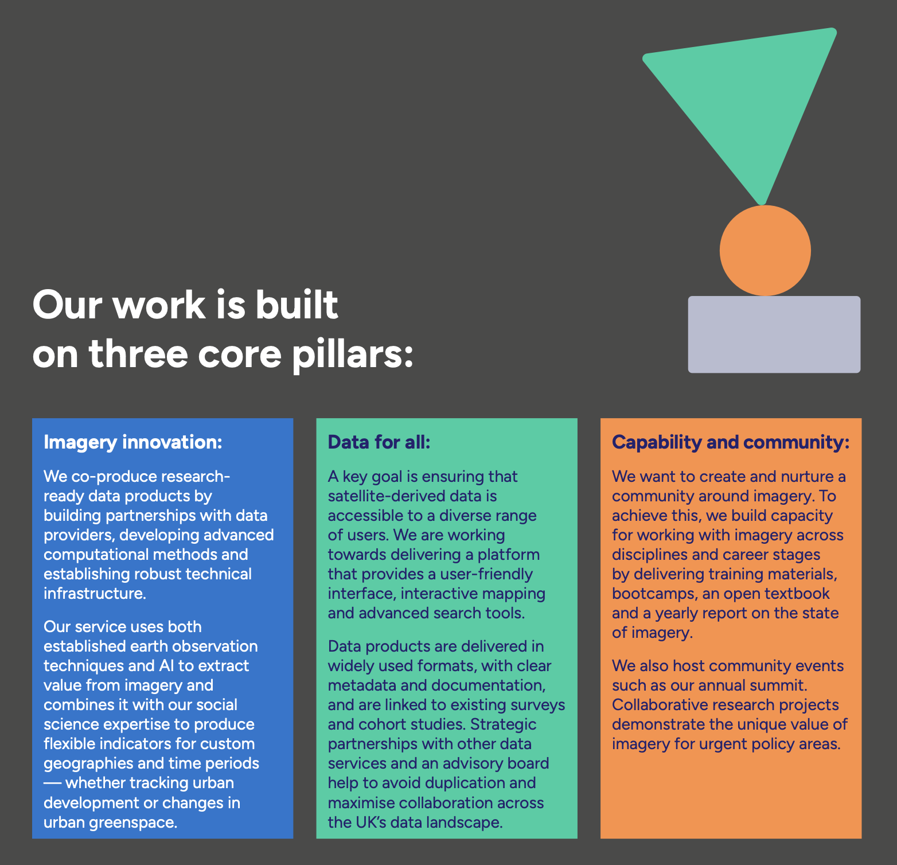
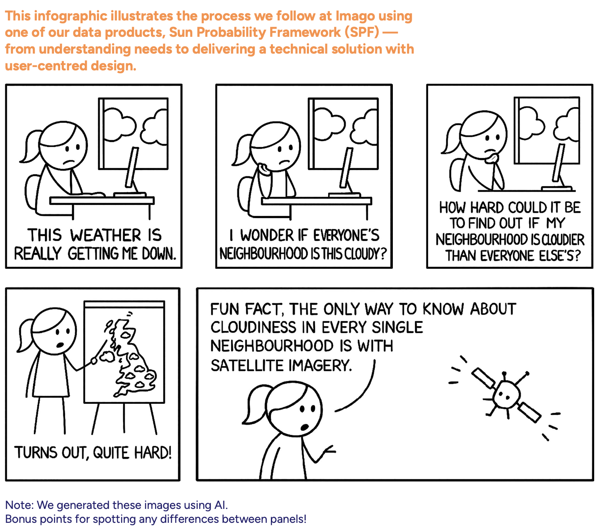
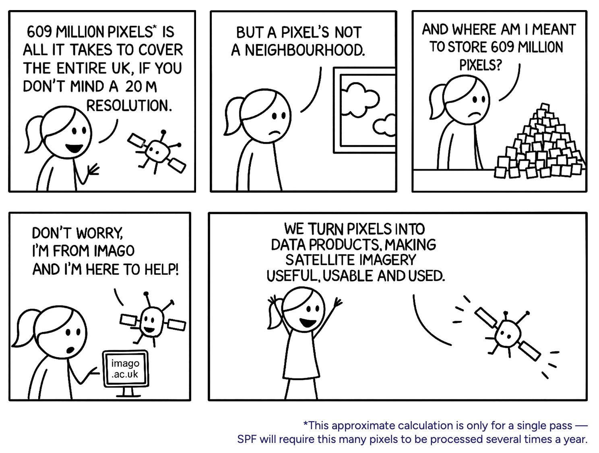

# From grids to areas {#sec-satellites-areas .unnumbered}

::: callout-note
## A note on context

This page was written for **[Imago](https://imago-data.com)** — the UK Imagery Data Service for sustainability, prosperity and wellbeing — and uses UK examples throughout (Thames, MSOAs, LSOAs). The conceptual steps it describes are general: the same chain (raw imagery → cleaned composite → modelled indicator → aggregated to areas) underlies the Beirut damage pipeline you've been working with in Parts 1 and 2. Read the UK examples as illustrative; the logic transfers directly.
:::

Imago is the Imagery Data Service for sustainability, prosperity and wellbeing. At Imago, our mission is to make (satellite) imagery more [useful, useable, and used]{style="color:#5ecba7"}.

::: {style="text-align: center;"}

:::

This page is a short tour of how satellite imagery becomes the kind of dataset social science researchers or policymakers can actually use — what gets collected, what shape it arrives in, and how [Imago]{style="color:#5ecba7"} turns it into neighbourhood-level statistics ready for analysis. The Beirut workflow you've seen does the same in miniature: pixels → classified change → operational-zone polygons.

## Pixel by pixel, clouds by cloud

Satellite data *looks* like a map—but it definitely isn’t one yet.

Before it becomes ready for analysis, it passes through a long chain of processing steps. What satellites actually beam down are raw, multi-band images: massive files full of noise, distortions, clouds, and values that don’t mean little until we transform them.

::: {style="text-align: center;"}
  
:::

::: {style="text-align: center;"}
  
:::

## How satellite data is collected

Satellites don't take photographs in the everyday sense. They are flying sensors that record the Earth's surface in a very specific, highly structured way. Four properties define what any satellite dataset is:

-   by **sensors** sensitive to specific ranges of wavelengths of light (the technical term is *spectral bands*)
-   at a **specific time** and from a **specific geographic area** (*spatiotemporal*)
-   at a particular **resolution** — one pixel corresponds to a square of ground, measured in *metres per pixel* (the whole image is a *scene* or *frame*)
-   with a particular **frequency** — the *refresh rate*, *revisit time*, or *repeat cycle* at which the satellite passes over the same place again

The illustration below shows what each of these means in practice. Click a tab to switch between them.

```{=html}
<style>
  /* === SECTION 1: How satellite data is collected === */
  .collect-scene {
    width: 100%;
    max-width: 760px;
    margin: 1rem 0 2rem;
    background: #FFFFFF;
    border: 1px solid #E2E5F3;
    border-radius: 8px;
    overflow: hidden;
    font-family: 'Figtree', sans-serif;
  }
  .collect-tabs {
    display: flex;
    flex-wrap: wrap;
    gap: 0;
    border-bottom: 1px solid #E2E5F3;
    background: #F5F6FB;
  }
  .collect-tabs label {
    flex: 1 1 0;
    min-width: 130px;
    padding: 0.7rem 0.9rem;
    font-size: 0.85rem;
    font-weight: 500;
    color: #4a4a49;
    text-align: center;
    cursor: pointer;
    border-right: 1px solid #E2E5F3;
    transition: background 0.12s ease, color 0.12s ease;
  }
  .collect-tabs label:last-child { border-right: none; }
  .collect-tabs label:hover { background: #E2E5F3; color: #24226F; }
  /* Hide the radio inputs themselves; we use them as state holders only */
  .collect-scene input[type="radio"] { position: absolute; left: -9999px; }

  /* When a radio is checked, style the matching label */
  #collect-1:checked ~ .collect-tabs label[for="collect-1"],
  #collect-2:checked ~ .collect-tabs label[for="collect-2"],
  #collect-3:checked ~ .collect-tabs label[for="collect-3"] {
    background: #FFFFFF;
    color: #24226F;
    font-weight: 600;
    box-shadow: inset 0 -3px 0 #FF8F42;
  }

  /* Stage panes: hidden by default, only the matching one shows */
  .collect-pane { display: none; padding: 1.25rem 1.25rem 0.25rem; }
  #collect-1:checked ~ .collect-pane.pane-1,
  #collect-2:checked ~ .collect-pane.pane-2,
  #collect-3:checked ~ .collect-pane.pane-3 { display: block; }

  .collect-pane svg { display: block; width: 100%; height: auto; max-height: 320px; }
  .collect-pane .pane-caption {
    font-size: 0.88rem;
    color: #4a4a49;
    line-height: 1.5;
    margin: 0.5rem 0 1rem;
  }
  .collect-pane .pane-caption strong { color: #24226F; font-weight: 600; }

  /* Subtle motion shared across panes */
  @keyframes pulse-soft { 0%, 100% { opacity: 0.4; } 50% { opacity: 0.85; } }

  .collect-scene .pulse { animation: pulse-soft 2.6s ease-in-out infinite; }

  @media (prefers-reduced-motion: reduce) {
    .collect-scene .pulse { animation: none; }
  }
</style>

<div class="collect-scene">
  <input type="radio" id="collect-1" name="collect-tabs" checked>
  <input type="radio" id="collect-2" name="collect-tabs">
  <input type="radio" id="collect-3" name="collect-tabs">

  <div class="collect-tabs">
    <label for="collect-1">Spatiotemporal</label>
    <label for="collect-2">Resolution</label>
    <label for="collect-3">Spectral bands</label>
  </div>

  <!-- ============ PANE 1: SPATIOTEMPORAL ============ -->
  <div class="collect-pane pane-1">
    <svg viewBox="0 0 760 320" xmlns="http://www.w3.org/2000/svg" preserveAspectRatio="xMidYMid meet">
      <!-- Sky -->
      <defs>
        <linearGradient id="sky-grad-1" x1="0" y1="0" x2="0" y2="1">
          <stop offset="0%"  stop-color="#E2E5F3"/>
          <stop offset="100%" stop-color="#FFFFFF"/>
        </linearGradient>
      </defs>
      <rect x="0" y="0" width="760" height="220" fill="url(#sky-grad-1)"/>

      <!-- Stars -->
      <circle cx="80"  cy="60" r="1.2" fill="#24226F" opacity="0.35"/>
      <circle cx="240" cy="45" r="1"   fill="#24226F" opacity="0.45"/>
      <circle cx="420" cy="75" r="1.4" fill="#24226F" opacity="0.3"/>
      <circle cx="590" cy="50" r="1"   fill="#24226F" opacity="0.4"/>
      <circle cx="690" cy="80" r="1.2" fill="#24226F" opacity="0.35"/>

      <!-- Ground -->
      <path d="M0,240 L0,225 C100,218 200,228 300,222 C400,216 500,228 600,222 C700,217 760,225 760,225 L760,290 L0,290 Z"
            fill="#B8BCD1" opacity="0.5"/>
      <path d="M0,240 L0,290 L760,290 L760,235 C660,242 560,228 460,235 C360,242 260,230 160,237 C80,242 0,235 0,240 Z"
            fill="#24226F" opacity="0.15"/>

      <!-- Thames -->
      <path d="M40,260 Q140,253 240,259 T440,257 T620,259 T760,255"
            stroke="#1877CF" stroke-width="2.5" fill="none" opacity="0.7" stroke-linecap="round"/>

      <!-- Trees (left) -->
      <g opacity="0.75">
        <rect x="78"  y="240" width="2.5" height="8" fill="#24226F"/>
        <circle cx="79"  cy="238" r="6"   fill="#03CEA3"/>
        <rect x="110" y="243" width="2"   height="6" fill="#24226F"/>
        <circle cx="111" cy="241" r="4.5" fill="#03CEA3"/>
        <rect x="135" y="241" width="2.5" height="7" fill="#24226F"/>
        <circle cx="136" cy="239" r="5.5" fill="#03CEA3"/>
        <rect x="165" y="244" width="2"   height="6" fill="#24226F"/>
        <circle cx="166" cy="242" r="4"   fill="#03CEA3"/>
      </g>

      <!-- Trees (right) -->
      <g opacity="0.75">
        <rect x="475" y="242" width="2.5" height="7" fill="#24226F"/>
        <circle cx="476" cy="240" r="5"   fill="#03CEA3"/>
        <rect x="505" y="244" width="2"   height="6" fill="#24226F"/>
        <circle cx="506" cy="242" r="4"   fill="#03CEA3"/>
        <rect x="585" y="241" width="2.5" height="8" fill="#24226F"/>
        <circle cx="586" cy="239" r="5.5" fill="#03CEA3"/>
        <rect x="615" y="243" width="2"   height="6" fill="#24226F"/>
        <circle cx="616" cy="241" r="4.5" fill="#03CEA3"/>
        <rect x="650" y="242" width="2.5" height="7" fill="#24226F"/>
        <circle cx="651" cy="240" r="5"   fill="#03CEA3"/>
        <rect x="685" y="244" width="2"   height="6" fill="#24226F"/>
        <circle cx="686" cy="242" r="4"   fill="#03CEA3"/>
        <rect x="715" y="242" width="2.5" height="7" fill="#24226F"/>
        <circle cx="716" cy="240" r="5"   fill="#03CEA3"/>
      </g>

      <!-- London skyline -->
      <g fill="#24226F" opacity="0.55">
        <rect x="260" y="225" width="8"  height="22"/>
        <rect x="272" y="218" width="10" height="29"/>
        <rect x="286" y="230" width="6"  height="17"/>
        <rect x="306" y="215" width="12" height="32"/>
        <rect x="322" y="222" width="7"  height="25"/>
        <polygon points="340,247 348,220 356,247"/>
        <rect x="365" y="228" width="9"  height="19"/>
        <rect x="380" y="212" width="14" height="35"/>
        <rect x="400" y="223" width="8"  height="24"/>
        <rect x="412" y="230" width="6"  height="17"/>
        <rect x="428" y="218" width="10" height="29"/>
        <rect x="445" y="225" width="9"  height="22"/>
      </g>

      <!-- Sample spot marker on the skyline -->
      <g>
        <circle cx="358" cy="236" r="14" fill="none" stroke="#FF8F42" stroke-width="1" stroke-dasharray="3 2" opacity="0.7"/>
        <circle class="pulse" cx="358" cy="236" r="9" fill="#FF8F42" opacity="0.35"/>
        <circle cx="358" cy="236" r="3" fill="#FF8F42"/>
      </g>
      <text x="358" y="282" text-anchor="middle" font-family="Figtree, sans-serif"
            font-size="11" font-weight="600" fill="#24226F">sample spot</text>

      <!-- Day labels -->
      <g font-family="Figtree, sans-serif" font-size="12" fill="#24226F">
        <line x1="120" y1="42" x2="120" y2="225" stroke="#8C91A8" stroke-width="0.8" stroke-dasharray="2 3" opacity="0.5"/>
        <circle cx="120" cy="42" r="2" fill="#FF8F42"/>
        <text x="120" y="32" text-anchor="middle" font-weight="600">Day 0</text>

        <line x1="358" y1="42" x2="358" y2="220" stroke="#8C91A8" stroke-width="0.8" stroke-dasharray="2 3" opacity="0.5"/>
        <circle cx="358" cy="42" r="2" fill="#FF8F42"/>
        <text x="358" y="32" text-anchor="middle" font-weight="600">Day 16</text>

        <line x1="600" y1="42" x2="600" y2="225" stroke="#8C91A8" stroke-width="0.8" stroke-dasharray="2 3" opacity="0.5"/>
        <circle cx="600" cy="42" r="2" fill="#FF8F42"/>
        <text x="600" y="32" text-anchor="middle" font-weight="600">Day 32</text>
      </g>

      <!-- Satellite — uses SVG-native animation in viewBox coordinates -->
      <g>
        <g>
          <!-- Solar panels -->
          <rect x="-30" y="85" width="20" height="10" fill="#03CEA3"/>
          <rect x="10"  y="85" width="20" height="10" fill="#03CEA3"/>
          <line x1="-30" y1="90" x2="-10" y2="90" stroke="#24226F" stroke-width="0.6"/>
          <line x1="10"  y1="90" x2="30"  y2="90" stroke="#24226F" stroke-width="0.6"/>
          <!-- Body -->
          <rect x="-8" y="83" width="16" height="14" rx="2" fill="#24226F"/>
          <!-- Sensor -->
          <circle cx="0" cy="99" r="2.5" fill="#FF8F42"/>
          <!-- Imaging beam -->
          <polygon class="pulse" points="0,122 -22,210 22,210" fill="#FF8F42" opacity="0.35"/>

          <animateTransform
            attributeName="transform"
            type="translate"
            values="50,0; 710,0; 50,0"
            keyTimes="0; 0.5; 1"
            dur="14s"
            repeatCount="indefinite"/>
        </g>
      </g>
    </svg>
    <p class="pane-caption">
      <strong>Spatiotemporal.</strong> Every observation is anchored to a <em>where</em> and a <em>when</em>. The same patch of ground (the highlighted sample spot) is recorded again and again on a regular revisit cycle &mdash; every few days for some sensors, every two to three weeks for others. Day 0, Day 16, Day 32, and so on. Comparing two passes of the same place at different times is what makes change detection possible: short revisit cycles let you track fast-changing things (floods, fires, crops), while longer cycles usually trade frequency for higher resolution.
    </p>
  </div>


  <!-- ============ PANE 2: RESOLUTION ============ -->
  <div class="collect-pane pane-2">
    <svg viewBox="0 0 760 320" xmlns="http://www.w3.org/2000/svg" preserveAspectRatio="xMidYMid meet">
      <!-- Three side-by-side resolutions of the same patch of ground -->
      <!-- Each panel is 220 wide x 220 tall, 20 gap -->

      <!-- ===== Panel 1: 1 km × 1 km (very coarse) ===== -->
      <g transform="translate(20, 60)">
        <!-- the whole panel is essentially "one giant pixel" -->
        <rect x="0" y="0" width="220" height="220" fill="#B8BCD1" stroke="#FF8F42" stroke-width="3"/>
        <text x="110" y="120" text-anchor="middle" font-family="Figtree, sans-serif"
              font-size="14" font-weight="600" fill="#24226F">1 pixel</text>
        <text x="110" y="138" text-anchor="middle" font-family="Figtree, sans-serif"
              font-size="11" fill="#24226F">= 1 km × 1 km</text>
        <!-- panel header -->
        <text x="110" y="-26" text-anchor="middle" font-family="Figtree, sans-serif"
              font-size="12" font-weight="600" fill="#24226F">1 km / pixel</text>
        <text x="110" y="-10" text-anchor="middle" font-family="Figtree, sans-serif"
              font-size="10" fill="#8C91A8">very coarse</text>
        <!-- panel footer caption -->
        <text x="110" y="248" text-anchor="middle" font-family="Figtree, sans-serif"
              font-size="10" fill="#4a4a49">whole town = one pixel</text>
      </g>

      <!-- ===== Panel 2: 30 m × 30 m (medium) ===== -->
      <g transform="translate(270, 60)">
        <!-- ground patches showing some structure, in Imago palette -->
        <rect x="0" y="0"   width="220" height="100" fill="#E2E5F3"/>
        <rect x="0" y="100" width="220" height="40"  fill="#03CEA3" opacity="0.55"/>
        <rect x="0" y="140" width="220" height="80"  fill="#B8BCD1" opacity="0.7"/>
        <path d="M0,165 Q110,160 220,170" stroke="#1877CF" stroke-width="5" fill="none" opacity="0.85"/>
        <!-- pixel grid: panel is 220x220, divide into 6x6 = ~37px squares -->
        <g stroke="#FFFFFF" stroke-width="0.6" opacity="0.55">
          <line x1="37"  y1="0" x2="37"  y2="220"/>
          <line x1="73"  y1="0" x2="73"  y2="220"/>
          <line x1="110" y1="0" x2="110" y2="220"/>
          <line x1="147" y1="0" x2="147" y2="220"/>
          <line x1="183" y1="0" x2="183" y2="220"/>
          <line x1="0" y1="37"  x2="220" y2="37"/>
          <line x1="0" y1="73"  x2="220" y2="73"/>
          <line x1="0" y1="110" x2="220" y2="110"/>
          <line x1="0" y1="147" x2="220" y2="147"/>
          <line x1="0" y1="183" x2="220" y2="183"/>
        </g>
        <!-- highlight one pixel -->
        <rect x="73" y="73" width="37" height="37" fill="none" stroke="#FF8F42" stroke-width="2.5"/>
        <!-- frame -->
        <rect x="0" y="0" width="220" height="220" fill="none" stroke="#24226F" stroke-width="1.5"/>
        <!-- header / footer -->
        <text x="110" y="-26" text-anchor="middle" font-family="Figtree, sans-serif"
              font-size="12" font-weight="600" fill="#24226F">30 m / pixel</text>
        <text x="110" y="-10" text-anchor="middle" font-family="Figtree, sans-serif"
              font-size="10" fill="#8C91A8">medium</text>
        <text x="110" y="248" text-anchor="middle" font-family="Figtree, sans-serif"
              font-size="10" fill="#4a4a49">a city block per pixel</text>
      </g>

      <!-- ===== Panel 3: 1 m × 1 m (very fine) ===== -->
      <g transform="translate(520, 60)">
        <!-- richly detailed ground in Imago palette -->
        <rect x="0" y="0" width="220" height="220" fill="#E2E5F3"/>
        <!-- tree clusters (teal) -->
        <g fill="#03CEA3" opacity="0.85">
          <circle cx="30"  cy="30" r="10"/>
          <circle cx="50"  cy="42" r="8"/>
          <circle cx="35"  cy="52" r="9"/>
          <circle cx="180" cy="40" r="9"/>
          <circle cx="195" cy="55" r="7"/>
        </g>
        <!-- buildings / roofs in indigo + muted blue-grey -->
        <rect x="80"  y="60"  width="50" height="35" fill="#24226F" opacity="0.75"/>
        <rect x="140" y="80"  width="40" height="30" fill="#B8BCD1"/>
        <rect x="60"  y="120" width="60" height="40" fill="#24226F" opacity="0.55"/>
        <rect x="140" y="130" width="55" height="40" fill="#B8BCD1" opacity="0.85"/>
        <!-- a road in deep indigo with orange dashes for centre line -->
        <rect x="0" y="180" width="220" height="14" fill="#24226F" opacity="0.7"/>
        <line x1="20"  y1="187" x2="40"  y2="187" stroke="#FF8F42" stroke-width="1.4"/>
        <line x1="60"  y1="187" x2="80"  y2="187" stroke="#FF8F42" stroke-width="1.4"/>
        <line x1="100" y1="187" x2="120" y2="187" stroke="#FF8F42" stroke-width="1.4"/>
        <line x1="140" y1="187" x2="160" y2="187" stroke="#FF8F42" stroke-width="1.4"/>
        <line x1="180" y1="187" x2="200" y2="187" stroke="#FF8F42" stroke-width="1.4"/>
        <!-- fine pixel grid (very faint, suggests pixels are tiny) -->
        <g stroke="#FFFFFF" stroke-width="0.3" opacity="0.4">
          <line x1="22"  y1="0" x2="22"  y2="220"/>
          <line x1="44"  y1="0" x2="44"  y2="220"/>
          <line x1="66"  y1="0" x2="66"  y2="220"/>
          <line x1="88"  y1="0" x2="88"  y2="220"/>
          <line x1="110" y1="0" x2="110" y2="220"/>
          <line x1="132" y1="0" x2="132" y2="220"/>
          <line x1="154" y1="0" x2="154" y2="220"/>
          <line x1="176" y1="0" x2="176" y2="220"/>
          <line x1="198" y1="0" x2="198" y2="220"/>
          <line x1="0" y1="22"  x2="220" y2="22"/>
          <line x1="0" y1="44"  x2="220" y2="44"/>
          <line x1="0" y1="66"  x2="220" y2="66"/>
          <line x1="0" y1="88"  x2="220" y2="88"/>
          <line x1="0" y1="110" x2="220" y2="110"/>
          <line x1="0" y1="132" x2="220" y2="132"/>
          <line x1="0" y1="154" x2="220" y2="154"/>
          <line x1="0" y1="176" x2="220" y2="176"/>
          <line x1="0" y1="198" x2="220" y2="198"/>
        </g>
        <rect x="0" y="0" width="220" height="220" fill="none" stroke="#24226F" stroke-width="1.5"/>
        <text x="110" y="-26" text-anchor="middle" font-family="Figtree, sans-serif"
              font-size="12" font-weight="600" fill="#24226F">1 m / pixel</text>
        <text x="110" y="-10" text-anchor="middle" font-family="Figtree, sans-serif"
              font-size="10" fill="#8C91A8">very fine</text>
        <text x="110" y="248" text-anchor="middle" font-family="Figtree, sans-serif"
              font-size="10" fill="#4a4a49">individual buildings + trees</text>
      </g>
    </svg>
    <p class="pane-caption">
      <strong>Resolution.</strong> Each pixel covers a square of ground, measured in <em>metres per pixel</em>. Public Earth-observation satellites span an enormous range &mdash; from coarse 1 km pixels (where a whole town is one cell, useful for global vegetation or sea-surface temperature) through medium 30 m pixels down to 1 m or finer (commercial sensors that resolve individual rooftops and trees). Higher resolution means more detail, but also bigger files, more compute, and often less frequent revisits.
    </p>
  </div>


  <!-- ============ PANE 3: SPECTRAL BANDS ============ -->
  <div class="collect-pane pane-3">
    <svg viewBox="0 0 760 320" xmlns="http://www.w3.org/2000/svg" preserveAspectRatio="xMidYMid meet">
      <!-- Sky -->
      <rect x="0" y="0" width="760" height="200" fill="#E2E5F3"/>
      <!-- Ground: mountains, forest, water, fields -->
      <polygon points="0,200 90,140 170,180 240,130 320,180 380,150 460,200" fill="#8C91A8" opacity="0.55"/>
      <polygon points="380,200 460,150 540,170 640,140 720,180 760,170 760,200" fill="#8C91A8" opacity="0.4"/>
      <rect x="0" y="200" width="760" height="35" fill="#03CEA3" opacity="0.7"/>
      <g fill="#03CEA3">
        <circle cx="40"  cy="205" r="8"/>
        <circle cx="80"  cy="208" r="7"/>
        <circle cx="130" cy="204" r="9"/>
        <circle cx="180" cy="207" r="7"/>
        <circle cx="240" cy="206" r="8"/>
        <circle cx="300" cy="208" r="7"/>
        <circle cx="370" cy="205" r="9"/>
        <circle cx="440" cy="207" r="8"/>
        <circle cx="510" cy="204" r="7"/>
        <circle cx="580" cy="206" r="9"/>
        <circle cx="650" cy="208" r="7"/>
        <circle cx="710" cy="205" r="8"/>
      </g>
      <path d="M0,250 Q150,240 320,255 T620,250 T760,258"
            stroke="#1877CF" stroke-width="10" fill="none" stroke-linecap="round" opacity="0.85"/>
      <rect x="0"   y="270" width="760" height="50" fill="#E2E5F3"/>
      <line x1="100" y1="270" x2="100" y2="320" stroke="#B8BCD1" stroke-width="2"/>
      <line x1="240" y1="270" x2="240" y2="320" stroke="#B8BCD1" stroke-width="2"/>
      <line x1="390" y1="270" x2="390" y2="320" stroke="#B8BCD1" stroke-width="2"/>
      <line x1="530" y1="270" x2="530" y2="320" stroke="#B8BCD1" stroke-width="2"/>
      <line x1="670" y1="270" x2="670" y2="320" stroke="#B8BCD1" stroke-width="2"/>

      <!-- Satellite + spectral beams -->
      <g transform="translate(360, 50)">
        <rect x="-8" y="-8" width="16" height="14" rx="2" fill="#24226F"/>
        <rect x="-30" y="-5" width="20" height="10" fill="#03CEA3"/>
        <rect x="10"  y="-5" width="20" height="10" fill="#03CEA3"/>
        <circle cx="0" cy="8" r="2.5" fill="#FF8F42"/>
        <line class="pulse" x1="0" y1="10" x2="-60" y2="220" stroke="#FF4D4D" stroke-width="2.5" opacity="0.7"/>
        <line class="pulse" x1="0" y1="10" x2="-30" y2="220" stroke="#FF8F42" stroke-width="2.5" opacity="0.7" style="animation-delay:0.2s"/>
        <line class="pulse" x1="0" y1="10" x2="0"   y2="220" stroke="#FFD93D" stroke-width="2.5" opacity="0.7" style="animation-delay:0.4s"/>
        <line class="pulse" x1="0" y1="10" x2="30"  y2="220" stroke="#03CEA3" stroke-width="2.5" opacity="0.7" style="animation-delay:0.6s"/>
        <line class="pulse" x1="0" y1="10" x2="60"  y2="220" stroke="#1877CF" stroke-width="2.5" opacity="0.7" style="animation-delay:0.8s"/>
        <line class="pulse" x1="0" y1="10" x2="90"  y2="220" stroke="#5B2EA8" stroke-width="2.5" opacity="0.7" style="animation-delay:1.0s"/>
      </g>

      <g font-family="Figtree, sans-serif" font-size="10" fill="#4a4a49">
        <text x="650" y="80">Red</text>
        <text x="650" y="98">Orange</text>
        <text x="650" y="116">Yellow</text>
        <text x="650" y="134">Green</text>
        <text x="650" y="152">Blue</text>
        <text x="650" y="170">Near-IR</text>
        <text x="640" y="190" font-style="italic" fill="#8C91A8">…and more</text>
      </g>
    </svg>
    <p class="pane-caption">
      <strong>Spectral bands.</strong> Some satellites collect "bands" &mdash; the strength of light in one slice of the electromagnetic spectrum. Optical satellites typically record six to twelve bands at once: red, green, blue, plus several invisible to the human eye (near-infrared, shortwave infrared, thermal). Different bands reveal different things &mdash; vegetation reflects strongly in near-infrared, water absorbs it; thermal bands measure surface temperature. Note that not every satellite has spectral bands &mdash; radar (SAR) sensors work differently.
    </p>
  </div>

</div>
```


## From pixels to neighbourhoods

What comes down isn't a map — it's a noisy grid of numbers, half of it hidden under cloud. Turning that into something a researcher or policymaker can use takes four steps. Watch the same patch of ground move through each of them:

```{=html}
<style>
  /* === SECTION: Pixels-to-MSOA pipeline === */
  .pipeline-scene {
    width: 100%;
    max-width: 880px;
    margin: 0 0 1rem;
    background: #FFFFFF;
    border: 1px solid #E2E5F3;
    border-radius: 8px;
    padding: 1.5rem 1.25rem 1rem;
    font-family: 'Figtree', sans-serif;
  }
  .pipeline-scene svg { display: block; width: 100%; height: auto; }
  .pipeline-scene .stage-num {
    font-size: 0.75rem;
    font-weight: 500;
    fill: #8C91A8;
    letter-spacing: 0.08em;
    text-anchor: middle;
  }
  .pipeline-scene .stage-title {
    font-size: 1.05rem;
    font-weight: 600;
    fill: #24226F;
    text-anchor: middle;
  }
  .pipeline-scene .stage-sub {
    font-size: 0.8rem;
    fill: #4a4a49;
    text-anchor: middle;
  }

  /* Cycle: 12s, 4 stages, with crossfade */
  @keyframes pipe-stage1 { 0%, 22% { opacity: 1; } 28%, 100% { opacity: 0; } }
  @keyframes pipe-stage2 { 0%, 22% { opacity: 0; } 28%, 47% { opacity: 1; } 53%, 100% { opacity: 0; } }
  @keyframes pipe-stage3 { 0%, 47% { opacity: 0; } 53%, 72% { opacity: 1; } 78%, 100% { opacity: 0; } }
  @keyframes pipe-stage4 { 0%, 72% { opacity: 0; } 78%, 100% { opacity: 1; } }

  @keyframes dot-pulse-1 { 0%, 22%   { fill: #FF8F42; r: 6; } 28%, 100% { fill: #B8BCD1; r: 5; } }
  @keyframes dot-pulse-2 { 0%, 22%   { fill: #B8BCD1; r: 5; } 28%, 47%  { fill: #FF8F42; r: 6; } 53%, 100% { fill: #B8BCD1; r: 5; } }
  @keyframes dot-pulse-3 { 0%, 47%   { fill: #B8BCD1; r: 5; } 53%, 72%  { fill: #FF8F42; r: 6; } 78%, 100% { fill: #B8BCD1; r: 5; } }
  @keyframes dot-pulse-4 { 0%, 72%   { fill: #B8BCD1; r: 5; } 78%, 100% { fill: #FF8F42; r: 6; } }

  .pipeline-scene .stage-1 { animation: pipe-stage1 12s ease-in-out infinite; }
  .pipeline-scene .stage-2 { animation: pipe-stage2 12s ease-in-out infinite; }
  .pipeline-scene .stage-3 { animation: pipe-stage3 12s ease-in-out infinite; }
  .pipeline-scene .stage-4 { animation: pipe-stage4 12s ease-in-out infinite; }
  .pipeline-scene .dot-1   { animation: dot-pulse-1 12s ease-in-out infinite; }
  .pipeline-scene .dot-2   { animation: dot-pulse-2 12s ease-in-out infinite; }
  .pipeline-scene .dot-3   { animation: dot-pulse-3 12s ease-in-out infinite; }
  .pipeline-scene .dot-4   { animation: dot-pulse-4 12s ease-in-out infinite; }

  @media (prefers-reduced-motion: reduce) {
    .pipeline-scene .stage-1,
    .pipeline-scene .stage-2,
    .pipeline-scene .stage-3,
    .pipeline-scene .stage-4 { animation: none; opacity: 1; }
    .pipeline-scene .dot-1,
    .pipeline-scene .dot-2,
    .pipeline-scene .dot-3,
    .pipeline-scene .dot-4 { animation: none; fill: #FF8F42; }
  }

  .pipeline-caption {
    max-width: 880px;
    font-family: 'Figtree', sans-serif;
    font-size: 0.92rem;
    color: #4a4a49;
    line-height: 1.55;
    margin: 0 0 2rem;
  }
  .pipeline-caption strong { color: #24226F; font-weight: 600; }
</style>

<div class="pipeline-scene" role="img" aria-label="Animated diagram showing the four-stage pipeline from raw satellite pixels through cleaning, modelling, and aggregation to neighbourhood-level data">
  <svg viewBox="0 0 880 480" xmlns="http://www.w3.org/2000/svg">

    <!-- ========================================================
         CENTRAL CANVAS: same 6x6 patch, four versions overlaid.
         Each pixel is 40x40 (square!). Canvas is 240x240.
         Centred at x=320..560, y=110..350.
         ======================================================== -->

    <!-- canvas frame -->
    <rect x="318" y="108" width="244" height="244" rx="4"
          fill="#FAFBFD" stroke="#E2E5F3" stroke-width="1"/>

    <!-- ---------- STAGE 1: Raw, noisy, with clouds ---------- -->
    <g class="stage-1">
      <g stroke="#FFFFFF" stroke-width="0.7">
        <rect x="320" y="110" width="40" height="40" fill="#8FA3C7"/>
        <rect x="360" y="110" width="40" height="40" fill="#A8B5D1"/>
        <rect x="400" y="110" width="40" height="40" fill="#7B92BD"/>
        <rect x="440" y="110" width="40" height="40" fill="#9BAACB"/>
        <rect x="480" y="110" width="40" height="40" fill="#6E86B5"/>
        <rect x="520" y="110" width="40" height="40" fill="#8AA0C5"/>

        <rect x="320" y="150" width="40" height="40" fill="#A2B0CE"/>
        <rect x="360" y="150" width="40" height="40" fill="#7E94BE"/>
        <rect x="400" y="150" width="40" height="40" fill="#6985B6"/>
        <rect x="440" y="150" width="40" height="40" fill="#90A4C8"/>
        <rect x="480" y="150" width="40" height="40" fill="#A6B3D0"/>
        <rect x="520" y="150" width="40" height="40" fill="#7290BB"/>

        <rect x="320" y="190" width="40" height="40" fill="#7B92BD"/>
        <rect x="360" y="190" width="40" height="40" fill="#92A6C9"/>
        <rect x="400" y="190" width="40" height="40" fill="#6E86B5"/>
        <rect x="440" y="190" width="40" height="40" fill="#8AA0C5"/>
        <rect x="480" y="190" width="40" height="40" fill="#7290BB"/>
        <rect x="520" y="190" width="40" height="40" fill="#9BAACB"/>

        <rect x="320" y="230" width="40" height="40" fill="#9BAACB"/>
        <rect x="360" y="230" width="40" height="40" fill="#7E94BE"/>
        <rect x="400" y="230" width="40" height="40" fill="#A2B0CE"/>
        <rect x="440" y="230" width="40" height="40" fill="#6985B6"/>
        <rect x="480" y="230" width="40" height="40" fill="#92A6C9"/>
        <rect x="520" y="230" width="40" height="40" fill="#8FA3C7"/>

        <rect x="320" y="270" width="40" height="40" fill="#6E86B5"/>
        <rect x="360" y="270" width="40" height="40" fill="#A6B3D0"/>
        <rect x="400" y="270" width="40" height="40" fill="#8AA0C5"/>
        <rect x="440" y="270" width="40" height="40" fill="#7B92BD"/>
        <rect x="480" y="270" width="40" height="40" fill="#9BAACB"/>
        <rect x="520" y="270" width="40" height="40" fill="#7E94BE"/>

        <rect x="320" y="310" width="40" height="40" fill="#92A6C9"/>
        <rect x="360" y="310" width="40" height="40" fill="#7290BB"/>
        <rect x="400" y="310" width="40" height="40" fill="#A2B0CE"/>
        <rect x="440" y="310" width="40" height="40" fill="#6985B6"/>
        <rect x="480" y="310" width="40" height="40" fill="#8FA3C7"/>
        <rect x="520" y="310" width="40" height="40" fill="#9BAACB"/>
      </g>
      <!-- clouds covering parts of the grid -->
      <g fill="#FFFFFF" opacity="0.92">
        <ellipse cx="385" cy="140" rx="48" ry="22"/>
        <ellipse cx="430" cy="128" rx="34" ry="16"/>
        <ellipse cx="500" cy="295" rx="44" ry="20"/>
        <ellipse cx="535" cy="310" rx="28" ry="14"/>
      </g>
    </g>

    <!-- ---------- STAGE 2: Cleaned composite ---------- -->
    <g class="stage-2">
      <g stroke="#FFFFFF" stroke-width="0.7">
        <rect x="320" y="110" width="40" height="40" fill="#94A6C8"/>
        <rect x="360" y="110" width="40" height="40" fill="#9CACCB"/>
        <rect x="400" y="110" width="40" height="40" fill="#88A0C2"/>
        <rect x="440" y="110" width="40" height="40" fill="#92A8CA"/>
        <rect x="480" y="110" width="40" height="40" fill="#8098BD"/>
        <rect x="520" y="110" width="40" height="40" fill="#90A4C6"/>

        <rect x="320" y="150" width="40" height="40" fill="#9AAACA"/>
        <rect x="360" y="150" width="40" height="40" fill="#8FA4C7"/>
        <rect x="400" y="150" width="40" height="40" fill="#8098BD"/>
        <rect x="440" y="150" width="40" height="40" fill="#94A6C8"/>
        <rect x="480" y="150" width="40" height="40" fill="#A0AECE"/>
        <rect x="520" y="150" width="40" height="40" fill="#86A0C2"/>

        <rect x="320" y="190" width="40" height="40" fill="#88A0C2"/>
        <rect x="360" y="190" width="40" height="40" fill="#94A6C8"/>
        <rect x="400" y="190" width="40" height="40" fill="#7E96BB"/>
        <rect x="440" y="190" width="40" height="40" fill="#90A4C6"/>
        <rect x="480" y="190" width="40" height="40" fill="#86A0C2"/>
        <rect x="520" y="190" width="40" height="40" fill="#9CACCB"/>

        <rect x="320" y="230" width="40" height="40" fill="#9AAACA"/>
        <rect x="360" y="230" width="40" height="40" fill="#8FA4C7"/>
        <rect x="400" y="230" width="40" height="40" fill="#9CACCB"/>
        <rect x="440" y="230" width="40" height="40" fill="#7E96BB"/>
        <rect x="480" y="230" width="40" height="40" fill="#92A8CA"/>
        <rect x="520" y="230" width="40" height="40" fill="#94A6C8"/>

        <rect x="320" y="270" width="40" height="40" fill="#8098BD"/>
        <rect x="360" y="270" width="40" height="40" fill="#A0AECE"/>
        <rect x="400" y="270" width="40" height="40" fill="#90A4C6"/>
        <rect x="440" y="270" width="40" height="40" fill="#8FA4C7"/>
        <rect x="480" y="270" width="40" height="40" fill="#9AAACA"/>
        <rect x="520" y="270" width="40" height="40" fill="#88A0C2"/>

        <rect x="320" y="310" width="40" height="40" fill="#92A8CA"/>
        <rect x="360" y="310" width="40" height="40" fill="#86A0C2"/>
        <rect x="400" y="310" width="40" height="40" fill="#9CACCB"/>
        <rect x="440" y="310" width="40" height="40" fill="#7E96BB"/>
        <rect x="480" y="310" width="40" height="40" fill="#94A6C8"/>
        <rect x="520" y="310" width="40" height="40" fill="#9AAACA"/>
      </g>
    </g>

    <!-- ---------- STAGE 3: Modelled indicator (heat ramp) ---------- -->
    <g class="stage-3">
      <g stroke="#FFFFFF" stroke-width="0.7">
        <rect x="320" y="110" width="40" height="40" fill="#FFD3A8"/>
        <rect x="360" y="110" width="40" height="40" fill="#FFC089"/>
        <rect x="400" y="110" width="40" height="40" fill="#FFA86A"/>
        <rect x="440" y="110" width="40" height="40" fill="#FFC089"/>
        <rect x="480" y="110" width="40" height="40" fill="#FFD3A8"/>
        <rect x="520" y="110" width="40" height="40" fill="#FFC089"/>

        <rect x="320" y="150" width="40" height="40" fill="#FFC089"/>
        <rect x="360" y="150" width="40" height="40" fill="#FF9E5A"/>
        <rect x="400" y="150" width="40" height="40" fill="#F37D31"/>
        <rect x="440" y="150" width="40" height="40" fill="#FF9E5A"/>
        <rect x="480" y="150" width="40" height="40" fill="#FFC089"/>
        <rect x="520" y="150" width="40" height="40" fill="#FFA86A"/>

        <rect x="320" y="190" width="40" height="40" fill="#FFA86A"/>
        <rect x="360" y="190" width="40" height="40" fill="#F37D31"/>
        <rect x="400" y="190" width="40" height="40" fill="#D9651E"/>
        <rect x="440" y="190" width="40" height="40" fill="#F37D31"/>
        <rect x="480" y="190" width="40" height="40" fill="#FFA86A"/>
        <rect x="520" y="190" width="40" height="40" fill="#FF9E5A"/>

        <rect x="320" y="230" width="40" height="40" fill="#FFC089"/>
        <rect x="360" y="230" width="40" height="40" fill="#FF9E5A"/>
        <rect x="400" y="230" width="40" height="40" fill="#F37D31"/>
        <rect x="440" y="230" width="40" height="40" fill="#FF9E5A"/>
        <rect x="480" y="230" width="40" height="40" fill="#FFC089"/>
        <rect x="520" y="230" width="40" height="40" fill="#FFA86A"/>

        <rect x="320" y="270" width="40" height="40" fill="#FFD3A8"/>
        <rect x="360" y="270" width="40" height="40" fill="#FFC089"/>
        <rect x="400" y="270" width="40" height="40" fill="#FFA86A"/>
        <rect x="440" y="270" width="40" height="40" fill="#FFC089"/>
        <rect x="480" y="270" width="40" height="40" fill="#FFD3A8"/>
        <rect x="520" y="270" width="40" height="40" fill="#FFC089"/>

        <rect x="320" y="310" width="40" height="40" fill="#FFC089"/>
        <rect x="360" y="310" width="40" height="40" fill="#FFA86A"/>
        <rect x="400" y="310" width="40" height="40" fill="#FFD3A8"/>
        <rect x="440" y="310" width="40" height="40" fill="#FF9E5A"/>
        <rect x="480" y="310" width="40" height="40" fill="#FFC089"/>
        <rect x="520" y="310" width="40" height="40" fill="#FFD3A8"/>
      </g>
    </g>

    <!-- ---------- STAGE 4: Neighbourhood polygons ---------- -->
    <g class="stage-4">
      <!-- ghost of the indicator pixels underneath -->
      <g opacity="0.18" stroke="#FFFFFF" stroke-width="0.5">
        <rect x="320" y="110" width="40" height="40" fill="#FFC089"/>
        <rect x="360" y="110" width="40" height="40" fill="#FFA86A"/>
        <rect x="400" y="110" width="40" height="40" fill="#F37D31"/>
        <rect x="440" y="110" width="40" height="40" fill="#FFA86A"/>
        <rect x="480" y="110" width="40" height="40" fill="#FFC089"/>
        <rect x="520" y="110" width="40" height="40" fill="#FFA86A"/>
        <rect x="320" y="150" width="40" height="40" fill="#FFA86A"/>
        <rect x="360" y="150" width="40" height="40" fill="#F37D31"/>
        <rect x="400" y="150" width="40" height="40" fill="#D9651E"/>
        <rect x="440" y="150" width="40" height="40" fill="#F37D31"/>
        <rect x="480" y="150" width="40" height="40" fill="#FFA86A"/>
        <rect x="520" y="150" width="40" height="40" fill="#FF9E5A"/>
        <rect x="320" y="190" width="40" height="40" fill="#F37D31"/>
        <rect x="360" y="190" width="40" height="40" fill="#D9651E"/>
        <rect x="400" y="190" width="40" height="40" fill="#D9651E"/>
        <rect x="440" y="190" width="40" height="40" fill="#F37D31"/>
        <rect x="480" y="190" width="40" height="40" fill="#FF9E5A"/>
        <rect x="520" y="190" width="40" height="40" fill="#FF9E5A"/>
        <rect x="320" y="230" width="40" height="40" fill="#FFA86A"/>
        <rect x="360" y="230" width="40" height="40" fill="#F37D31"/>
        <rect x="400" y="230" width="40" height="40" fill="#FFA86A"/>
        <rect x="440" y="230" width="40" height="40" fill="#F37D31"/>
        <rect x="480" y="230" width="40" height="40" fill="#FFC089"/>
        <rect x="520" y="230" width="40" height="40" fill="#FFA86A"/>
        <rect x="320" y="270" width="40" height="40" fill="#FFC089"/>
        <rect x="360" y="270" width="40" height="40" fill="#FFA86A"/>
        <rect x="400" y="270" width="40" height="40" fill="#FFA86A"/>
        <rect x="440" y="270" width="40" height="40" fill="#FFC089"/>
        <rect x="480" y="270" width="40" height="40" fill="#FFD3A8"/>
        <rect x="520" y="270" width="40" height="40" fill="#FFC089"/>
        <rect x="320" y="310" width="40" height="40" fill="#FFD3A8"/>
        <rect x="360" y="310" width="40" height="40" fill="#FFC089"/>
        <rect x="400" y="310" width="40" height="40" fill="#FFC089"/>
        <rect x="440" y="310" width="40" height="40" fill="#FFA86A"/>
        <rect x="480" y="310" width="40" height="40" fill="#FFC089"/>
        <rect x="520" y="310" width="40" height="40" fill="#FFD3A8"/>
      </g>
      <!-- 6 polygons drawn over the ghost grid -->
      <polygon points="320,110 440,110 425,210 320,200"
               fill="#FFC089" stroke="#24226F" stroke-width="1.6"/>
      <polygon points="440,110 560,110 560,218 425,210"
               fill="#FFA86A" stroke="#24226F" stroke-width="1.6"/>
      <polygon points="320,200 425,210 415,290 320,280"
               fill="#F37D31" stroke="#24226F" stroke-width="1.6"/>
      <polygon points="425,210 560,218 560,300 415,290"
               fill="#FF9E5A" stroke="#24226F" stroke-width="1.6"/>
      <polygon points="320,280 415,290 425,350 320,350"
               fill="#FFA86A" stroke="#24226F" stroke-width="1.6"/>
      <polygon points="415,290 560,300 560,350 425,350"
               fill="#FFC089" stroke="#24226F" stroke-width="1.6"/>
    </g>

    <!-- ============ STAGE LABELS ============ -->
    <g class="stage-1">
      <text x="440" y="68" class="stage-num">STAGE 1 OF 4</text>
      <text x="440" y="92" class="stage-title">Raw imagery</text>
      <text x="440" y="380" class="stage-sub">A noisy spectral grid, partly hidden by cloud</text>
    </g>
    <g class="stage-2">
      <text x="440" y="68" class="stage-num">STAGE 2 OF 4</text>
      <text x="440" y="92" class="stage-title">Cleaned composite</text>
      <text x="440" y="380" class="stage-sub">Many passes combined to remove cloud and noise</text>
    </g>
    <g class="stage-3">
      <text x="440" y="68" class="stage-num">STAGE 3 OF 4</text>
      <text x="440" y="92" class="stage-title">Modelled indicator</text>
      <text x="440" y="380" class="stage-sub">Pixels turned into something meaningful — e.g. surface temperature</text>
    </g>
    <g class="stage-4">
      <text x="440" y="68" class="stage-num">STAGE 4 OF 4</text>
      <text x="440" y="92" class="stage-title">Aggregated to neighbourhoods</text>
      <text x="440" y="380" class="stage-sub">One value per area, ready to join with surveys and policy data</text>
    </g>

    <!-- ============ PROGRESS DOTS ============ -->
    <g>
      <line x1="220" y1="430" x2="660" y2="430" stroke="#E2E5F3" stroke-width="2"/>
      <circle class="dot-1" cx="220" cy="430" r="5" fill="#FF8F42"/>
      <circle class="dot-2" cx="367" cy="430" r="5" fill="#B8BCD1"/>
      <circle class="dot-3" cx="513" cy="430" r="5" fill="#B8BCD1"/>
      <circle class="dot-4" cx="660" cy="430" r="5" fill="#B8BCD1"/>
      <text x="220" y="455" text-anchor="middle" font-family="Figtree, sans-serif" font-size="11" fill="#8C91A8">raw</text>
      <text x="367" y="455" text-anchor="middle" font-family="Figtree, sans-serif" font-size="11" fill="#8C91A8">clean</text>
      <text x="513" y="455" text-anchor="middle" font-family="Figtree, sans-serif" font-size="11" fill="#8C91A8">model</text>
      <text x="660" y="455" text-anchor="middle" font-family="Figtree, sans-serif" font-size="11" fill="#8C91A8">aggregate</text>
    </g>
  </svg>
</div>

  <strong style="color:#24226F">Stage 1 — raw.</strong> Spectral values come down noisy, with cloud blocking parts of the ground.
  <p>
  <strong style="color:#24226F">Stage 2 — clean.</strong> Combining many passes through time gives a clean composite.
    <p>
  <strong style="color:#24226F">Stage 3 — model.</strong> A model converts the cleaned spectral values into a meaningful indicator (here, surface temperature; in other Imago products, vegetation, built-up area, or cloud probability).
    <p>
  <strong style="color:#24226F">Stage 4 — aggregate.</strong> Pixels are pooled into administrative units — MSOAs in England — so the data can be joined to censuses, surveys, and policy frameworks.


```

## Why Imago products simplify the process

Working directly with raw satellite data is difficult for most users. Files are huge — a single Sentinel-2 scene is several gigabytes. Cleaning, mosaicking, and modelling pixel-level data requires significant compute and a working knowledge of remote-sensing algorithms. And even after processing, linking pixel-level information to meaningful social or administrative units is technically demanding.

Pre-processed and validated products save time, reduce errors, and ensure consistent, reliable results. Imago provides:

-   [Pre-computed, ready-to-use]{style="color:#5ecba7"} MSOA/LSOA-level statistics
-   No need to download or handle [large imagery]{style="color:#5ecba7"} or run [complex algorithms]{style="color:#5ecba7"}
-   Preserved local detail — the clear benefit of small-area data, not regional averages